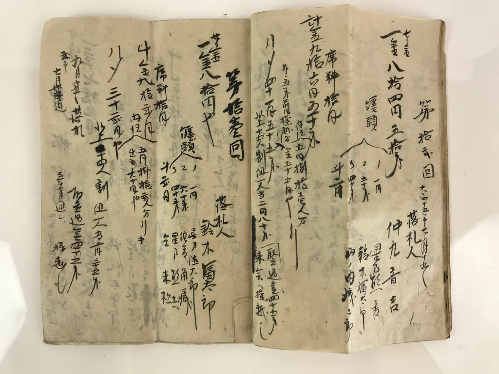
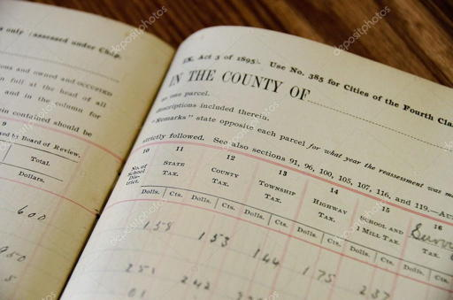

Ledgers have been used for millennia to record significant events such as marriages and land transfers as well as more-mundane events like shop sales, museum visitors and captain’s logs. One finds ledgers throughout recorded history, across all parts of the world and in every walk of life.

Ledgers show up everywhere because humans understand their purpose and use. Our trust in ledgers comes from these universal properties:

1. Immutability. People write events down using ink on the page, or form entries into clay, or any other permanent recording technology. We understand that events cannot be altered later. Once an event has been recorded, it cannot be changed.
2. Sequenced. Events occur over time, in order. The ledger design ensures that events cannot be inserted before already-recorded events. This shows any reader how state change flows over time and as well as current state.

We use ledgers to record meaningful events when they occur, and then use these ledgers to answer many questions, such as:

* How much tax has been paid on a property?
* What are the day’s sales?
* How much inventory should we have?
* When was someone born?
* How many people were born during a time period?

In fact, all meaningful questions can be answered by reviewing event ledgers and reducing out an answer. One would be hard-pressed to come up with a question that cannot be answered by processing relevant events from a ledger.

So, as you consider building software using Evently’s ledger service, remember the generations of people who came before you and solved their information architecture with the exact same information architecture, though you will not have to clean clay from your nails or ink from your fingertips!
